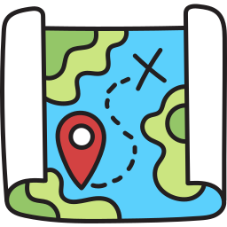
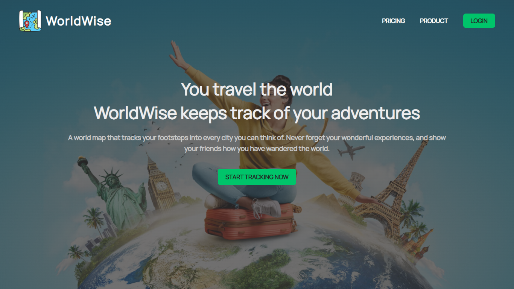
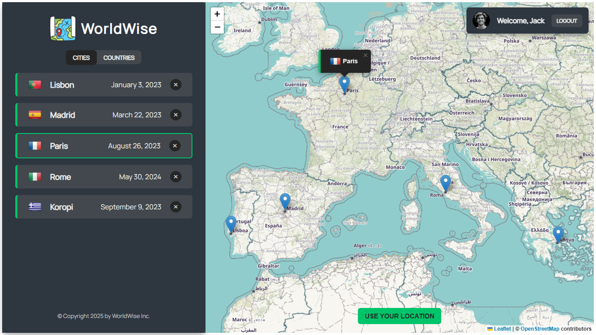
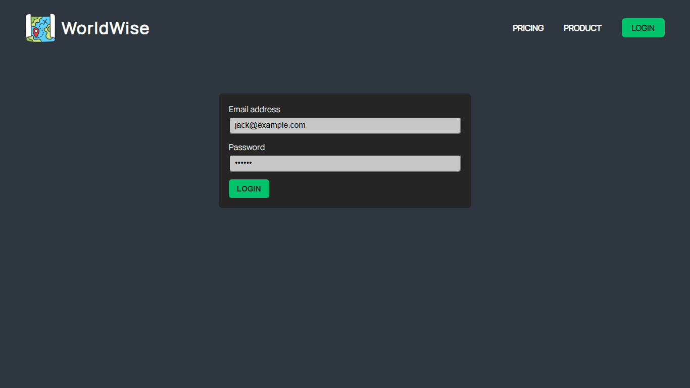
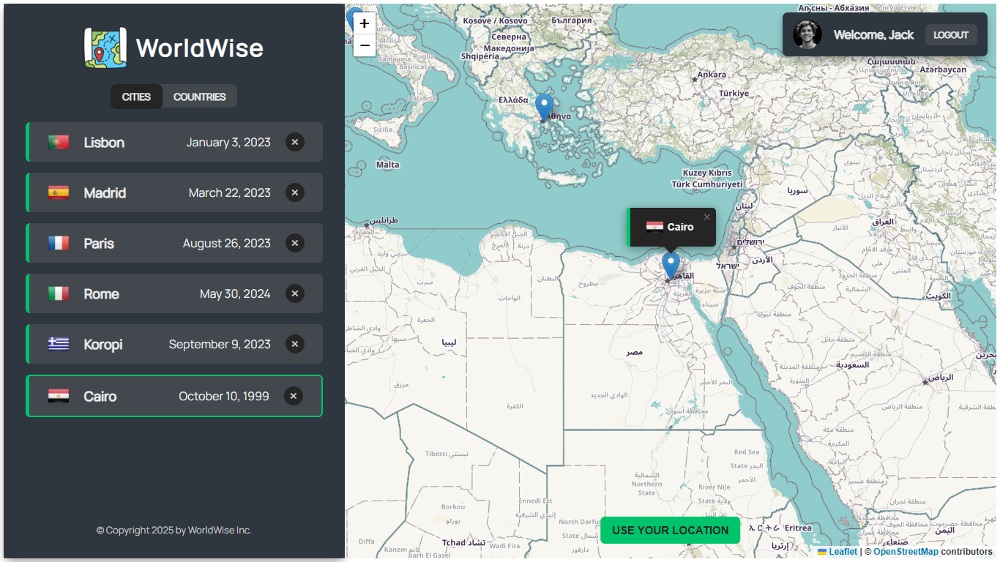
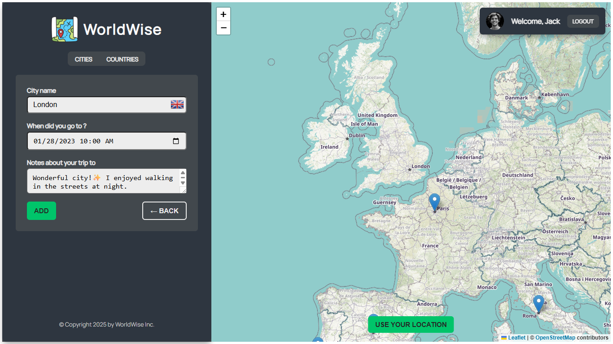
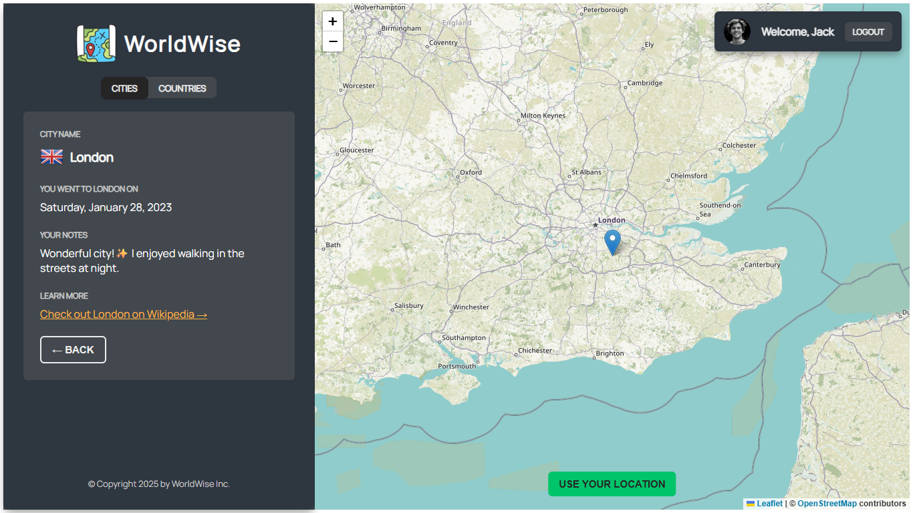
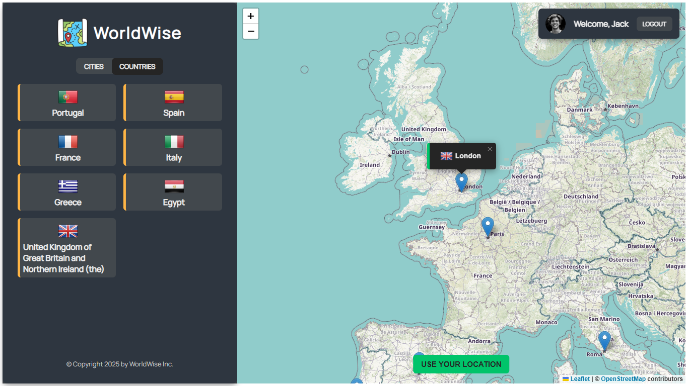

<div align="center">
    
    <h1>WorldWise Application</h1>
</div>

<div align="center">

    

</div>




## 📋 Overview

**WorldWise** is a Web Application that enables you save the places where you have been and the places you want to go. It is a simple app that allows you to create a list of places you have been and places you want to go. You can also add notes to each place. It is a great way to keep track of your travels and plan your next trip.


## 🔑 Key Features

- ✅ Create a list of **places you've visited** and **places you want to go**.
- 🌐 **Search and select countries/cities** you want to visit and add them to your list.
- 📝 **Add notes** to each location to remember details or plans.
- 📍 **Automatically locate your current position** on the map.
- 🔐 **Secure authentication** to protect your travel list.


## 🚀 Demo

View the live demo of the app: [WorldWise](https://worldwise-egypt.netlify.app)




## 🧭 How the App Works

WorldWise is designed to be intuitive and travel-focused. Here’s how it works:

### 1. 🔐 Sign In Securely

The app requires you to **sign in** to access and manage your personal travel list. This ensures your data stays private and synced across sessions.



---

### 2. 📍 Instantly See Your Cities on the Map

After signing in, you’ll immediately see **pins on the map** representing the **cities you’ve visited** and those you’re **planning to visit**.

Each pin shows a tooltip with the city name and lets you view the note and date you've added.



---

### 3. ➕ Add Places to Your List

Search for any city and add optional notes to remember why or when you have visited it.



---

### 4. 📝 View Pin Details

When you click on a city in the list, you can see added notes with date and link to the Wikipedia page about that city.



---

### 5. 🌍 View Visited Countries Summary

In addition to city pins, the app automatically tracks the **countries** you've visited based on your added cities.



---


## 🛠️ Technologies Used

- [React](https://reactjs.org/) : Frontend library for building user interfaces.

- [React Router](https://reactrouter.com/) : Client-side routing for SPA navigation.

- [React leaflet](https://react-leaflet.js.org/) : Interactive maps with markers for locations.

- **CSS Modules**: Scoped styling for React components.

- **Netlify**: For Hosting and continuous deployment.


## 📦 Setup Instructions

1. Clone the repository:
   ```bash
   git clone https://github.com/hazemhesham-1/worldwise.git
   ```
2. Navigate to the project directory:
   ```bash
   cd worldwise
   ```
3. Install the dependencies:
   ```bash
   npm install
   ```
4. Run the development server:
   ```bash
   npm run dev
   ```
5. Open your browser and navigate to [http://localhost:5173/](http://localhost:5173/) to access WorldWise application.

6. Login with already created account and start adding your cities to the list.